Серийная и последовательная организация файла. Структура, формирование, поиск, обработка, обновление, применение и оценка. ОД – Серийная и последовательная.
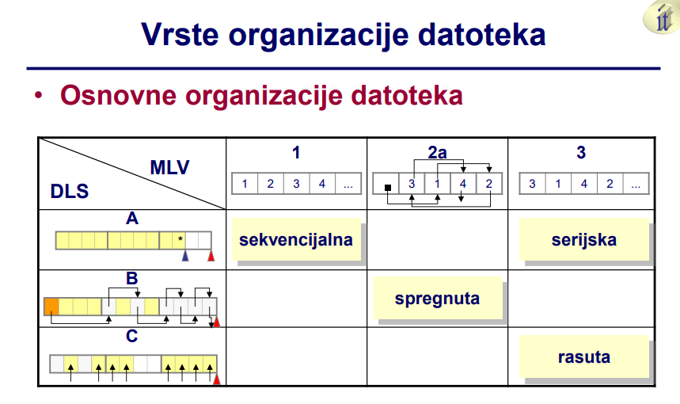
Основная структура – записи размещены одна за другой • в последовательные ячейки памяти • физическая структура не содержит информации о связях между записями логической структуры файла • нет связи между значением ключа записи и адресом места, где она находится • порядок сохранения записей обычно соответствует хронологическому порядку их создания • записи могут быть блокированы, но это необязательно OD – Серийная и последовательная
Основная структура – записи размещены одна за другой • в последовательные ячейки памяти • физическая структура не содержит информации о связях между записями логической структуры файла • нет связи между значением ключа записи и адресом места, где она находится • порядок сохранения записей обычно соответствует хронологическому порядку их создания • записи могут быть блокированы, но это необязательно OD – Серийная и последовательная 4
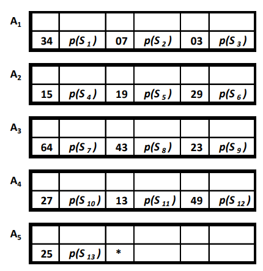
 Формирование серийного файла – серийный файл создается • обычно в процессе сбора данных – записи • формируются передачей данных из различных источников – исходные документы – устройства и программное обеспечение для считывания значений (в реальном времени) • записываются одна за другой в последовательные ячейки памяти • каждая новая запись добавляется в конец файла – результат сбора данных • неблокированный или • заблокированный серийный файл
 
 Формирование серийного файла – сбор данных • процесс, направленный на обеспечение начального сохранения правильных данных – основная деятельность: запись данных на носитель, выполняется • оператор человек, используя • программу с соответствующим пользовательским интерфейсом для форматирования данных и • соответствующие устройства ввода/вывода, или • специализированное программное обеспечение с соответствующим аппаратным обеспечением

 Формирование серийного файла – пользовательский интерфейс программы для сбора данных – программа форматирования • описание формата документа – расположение полей (layout), экранный вид • правила навигации – перемещение курсора между полями • описания и форматирование содержимого полей • специальные контроли содержимого полей • разрешенные операции с содержимым полей

 Серийная организация файла. • Пользовательский интерфейс программы для сбора данных – описание формата документа – расположение полей (layout)
 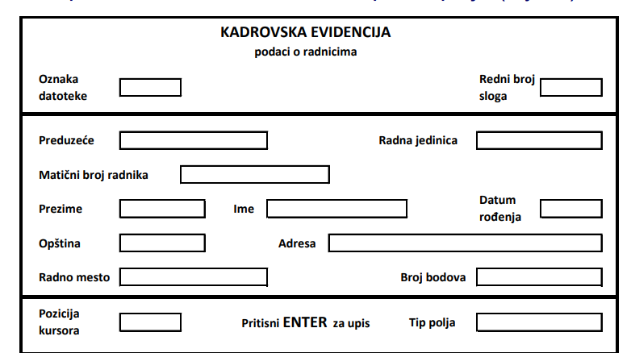

 Пользовательский интерфейс программы для сбора данных – правила навигации – перемещение курсора между полями • возможность доступа к полям с помощью мыши или клавиатуры • порядок перехода между полями в навигации – с помощью клавиши <TAB>, <ENTER>, или автоматический Серийная организация файла. • Пользовательский интерфейс программы для сбора данных – описания и форматирование содержимого полей • фиксированный текст (заголовок) и текстовые инструкции с описанием полей • тип поля (алфавитный, числовой, алфанумерический, даты) • способ визуализации содержимого – текстовое поле, раскрывающийся список, комбо-бокс, радио-группа – скрытое поле содержимого – формат маски для числовых или датных значений – задание визуальных атрибутов поля на форме • максимальное количество символов, которое можно ввести • способ выравнивания содержимого поля (слева, справа, по центру) • способ переноса содержимого текстовых полей (без переноса, перенос на один символ, перенос на целое слово)

 Пользовательский интерфейс программы для сбора данных – специальные контроли содержимого полей • обязательность ввода хотя бы одного символа в поле • обязательность полного заполнения содержимого поля • контроль на допустимый диапазон (домен) значений • контроль по модулю – только для числовых полей – числу из n цифр присваивается одна контрольная цифра, которая вычисляется с использованием специального алгоритма для числа из n цифр • проверка, находится ли введенные данные в таблице/списке допустимых значений Пользовательский интерфейс программы для сбора данных – разрешенные операции с содержимым полей • ручной ввод содержимого поля • модификация существующего содержимого поля • удаление содержимого одного, выбранных или всех полей • дублирование содержимого одного, выбранных или всех полей – с целью повышения производительности оператора – когда одно и то же или почти одинаковое содержимое поля повторяется несколько раз Формирование серийного файла – сбор данных – время выполнения • в реальном времени – на месте и в момент возникновения данных • в отложенном режиме (позднее) – после определенного временного интервала от возникновения данных – как правило, выполняется оператором, который не регистрировал исходные данные, на основе вручную созданных документов – верификация – верификация • процедура существенной проверки правильности введенных данных (ручная или автоматизированная) – например, другой оператор повторно вводит уже введенные данные, используя тот же исходный документ – например, использование интеллектуальных программных решений

 Поиск записи в серийном файле – поиск случайно выбранной записи • нет функциональной связи между значением ключа и адресом местоположения записи • поиск логически следующей записи = поиск случайно выбранной – применение метода линейного поиска • начинается с начала файла • обращение к последовательно сохраненным блокам и записям – успешный поиск, общее количество обращений Ru: 1 ≤ Ru ≤ B – неудачный поиск, общее количество обращений Rn: Rn = B • B – общее количество блоков в серийном файле Поиск записи в серийном файле – общее количество блоков в файле: • N – количество записей • f – фактор блокировки • + 1 - из-за специальной записи с меткой конца файла – успешный поиск, ожидаемое (среднее) количество обращений • вероятность поиска любой записи в файле одинакова, 1 / N • когда f | N, т.е. B = N / f + 1, или когда N >> 1, тогда: OD – Серийная и последовательная
 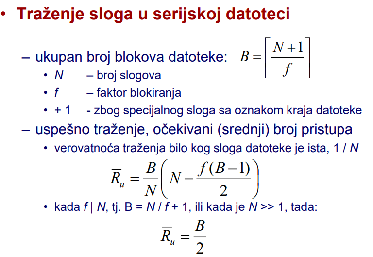
 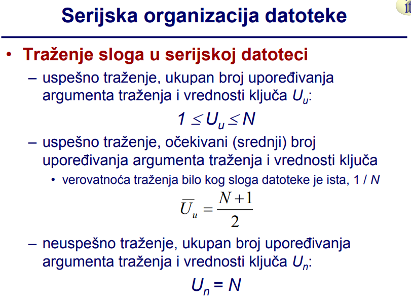
 
Поиск записи в серийном файле – успешный поиск, общее количество сравнений аргумента поиска и значения ключа Uu: 1 ≤ Uu ≤ N – успешный поиск, ожидаемое (среднее) количество сравнений аргумента поиска и значения ключа • вероятность поиска любой записи в файле одинакова, 1 / N – неудачный поиск, общее количество сравнений аргумента поиска и значения ключа Un: Un = N Обработка серийного файла – виды • прямая обработка • последовательная обработка – при использовании последовательного доступа к записям в хронологическом порядке – может использоваться как основная в режиме прямой обработки – может использоваться как основная в последовательной обработке файла, ключ которого содержит • как свой внешний ключ • когда упорядочено согласно неубывающим значениям этого внешнего ключа

Обработка серийного файла – программа, выполняющая последовательную обработку серийного файла • загружает последовательные записи ведущего файла • каждая следующая запись ведущего файла содержит логическое следующее значение ключа обрабатываемого серийного файла • эти значения ключа используются как аргументы для поиска в серийном файле методом линейного поиска – в режиме прямой обработки • последовательные записи ведущего файла содержат случайно выбранные значения ключа обрабатываемого серийного файла • поиск также линейный – поиск логически следующей и случайно выбранной записи в серийном файле • выполняется идентично, начиная с первой записи файла

Серийная организация файла • Пример - небольшой серийный файл - Dser – записей N = 13 – фактор блокировки f = 3 – Прямая обработка • Содержимое ведущего файла: • 64, 21, 8, 3 – Последовательная обработка • Содержимое ведущего файла: • 3, 8, 21, 64
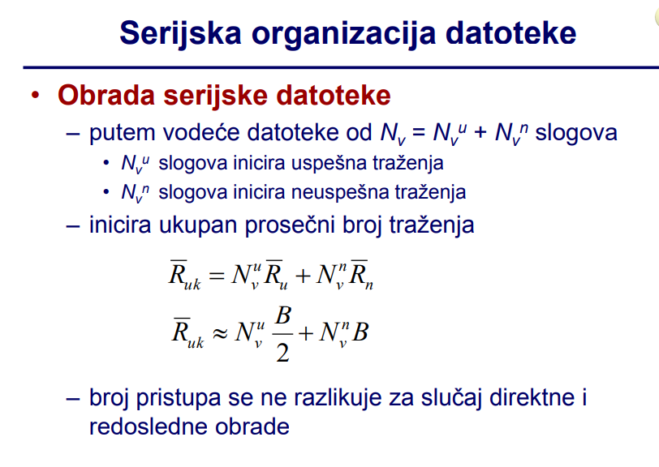
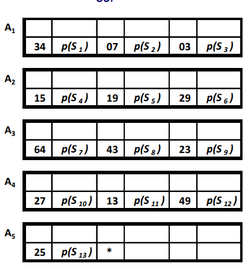
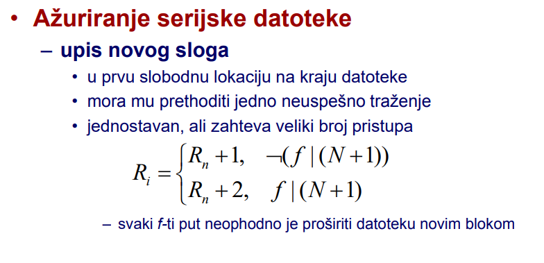
Обновление серийного файла – добавление новой записи • в первую свободную ячейку в конце файла • перед этим должен быть один неудачный поиск • простой, но требует большого количества обращений – каждый f-й раз необходимо расширить файл новым блоком

Обновление серийного файла – удаление существующей записи • перед этим должен быть один успешный поиск • чаще всего логическое удаление – изменение статуса актуальности записи • физическое удаление требовало бы большого количества обращений – модификация содержимого существующей записи • перед этим должен быть один успешный поиск – ожидаемое количество обращений для • логического удаления или • модификации содержимого записи OD – Серийная и последовательная 1 Области применения и оценка характеристик – удобны для небольших файлов • когда они могут быть полностью помещены в ОП • из-за очень большого количества обращений, необходимого для поиска логически следующей или случайно выбранной записи • другие типы организации приносят лишь небольшие улучшения в эффективности обработки маленьких файлов – серийная организация данных в сочетании с индексными структурами • очень удобна для прямой обработки • основная физическая структура реляционных баз данных – серийный файл в результате сбора данных • отправная точка для построения файлов с другими типами организации данных

Секвенциальная организация файла • Основная структура – записи располагаются последовательно одна за другой – логически соседние записи хранятся в физически соседних местоположениях • существует информация о связях между записями логической структуры данных файла, встроенной в физическую структуру • реализована как линейная логическая структура данных – размещение записи с более высоким значением ключа в местоположение с более высоким адресом • упорядочивание по значению ключа в порядке возрастания  запись с минимальным значением ключа размещается в первом месте – также называется физической последовательной организацией OD – Серийная и последовательная 27 Основная структура – связь между сохраненными значениями ключа k(S) и адресами местоположений • не встроена в структуру файла • не представляет собой какую-либо математическую функцию – записи размещаются в блоках по f (1) записей • желательно, чтобы фактор блокировки f был как можно больше – современные ОС (Unix) и языки программирования (C, C++, Java) поддерживают только последовательный способ доступа • пользователям оставлено создавать свои собственные последовательные методы доступа Пример - небольшой последовательный файл - Dsek – записей N = 13 – фактор блокировки f = 3 – записи • такое же содержимое, как и в Dser • пары (k(Si),p(Si)) • k(Si) - значение ключа • p(Si) - конкретизация остальных характеристик записи Si (i = 1,...,13) • метка конца файла: * • индексы i (i=1,...,13) указывают на логический порядок размещения записей

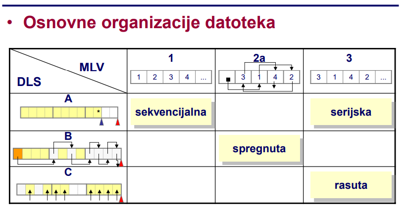
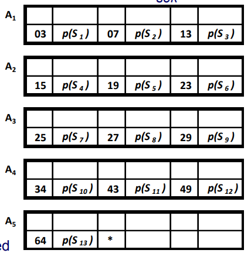
Создание последовательного файла – обычно путем сортировки серийного файла – в соответствии с возрастающими или убывающими значениями ключа Поиск записи в последовательном файле • логически следующей или • случайно выбранной – поиск случайно выбранной записи • возможное применение методов – линейного поиска – бинарного поиска • не имеет практического смысла, если файл большой и находится на внешнем запоминающем устройстве • имеет практический смысл, если весь файл помещается в ОП – его, в этом случае, можно представить • как линейную структуру над множеством записей или • как блок другого файла, например, индекс-последовательного Поиск записи в последовательном файле – поиск логически следующей записи • линейным методом поиска • начиная с первой, физически соседние блоки загружаются в ОП • в центральном блоке выполняется сравнение аргументов поиска и значений ключей последовательных записей, пока • искомая запись не будет найдена • аргумент поиска не станет меньше значения ключа записи • не достигнет конца файла • поиск новой логически следующей записи начинается с записи, на которой остановился предыдущий поиск – текущей записи файла

Поиск записи в последовательном файле – поиск логически следующей записи – количество доступов при успешном и неуспешном поиске 0 ≤ R ≤ B - i • i - порядковый номер текущего блока относительно начала – количество сравнений аргументов поиска и значений ключей записей при успешном и неуспешном поиске 1 ≤ U ≤ N - i + 1 • i - порядковый номер текущей записи Обработка последовательного файла • последовательная • прямая – прямая обработка • имеет смысл, если последовательный файл маленький и может поместиться в оперативную память • производительность обработки немного отличается от производительности обработки серийного файла n n vu u vuk RNRNR Обработка последовательного файла – ведущий файл в прямой и последовательной обработке • часто используется • последовательная загрузка физически соседних записей, начиная с первой и заканчивая последней • общее количество доступов, когда последовательный файл используется в качестве ведущего в обработке Обработка последовательного файла – последовательная обработка • итеративный процесс • ведущий файл генерирует логически следующие значения ключа для поиска в обрабатываемом последовательном файле – каждый шаг обработки = поиск логически следующей записи • выполняется методом линейного поиска – каждый блок файла загружается в ОП только один раз – ведущий файл содержит Nv (Nv ≥ 1) записей • включает значение ключа, большее или равное максимальному значению ключа в обрабатываемом файле
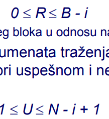
Обработка последовательного файла – последовательная обработка – общее количество доступов Ruk = B – среднее количество доступов к каждому поиску • чем меньше R, тем эффективнее обработка • предпочтительны большие значения фактора блокировки f и большого числа поисков Nv – общее количество сравнений U ≥ N + Nv – среднее количество сравнений vNBR  1 Обновление последовательного файла – запись новой записи • нахождение места для записи новой записи – неудачный поиск – место записи записи с первым ключом большим, чем у данной записи • сдвиг на одну позицию вправо всех записей с ключами больше, чем ключ новой записи – удаление существующей записи • предварительный поиск записи – успешный поиск • сдвиг на одну позицию влево всех записей с более высоким ключом, если удаление физическое – изменение содержания записи • предварительный поиск записи – успешный поиск – запись и удаление: серьезная проблема общего числа доступов Обновление последовательного файла – в режиме прямой обработки • в среднем смещение половины общего числа записей на одну позицию вправо (при вставке) или влево (при удалении) записи • применяется, когда весь файл помещается в ОП – в режиме последовательной обработки • особенный итеративный процесс – создание полностью нового файла на основе существующего • подходит, когда файл не может быть полностью помещен в оперативную память • файлы и их роли в обработке – Ds - обрабатываемый, входной (старый) последовательный файл – Dn - обработанный, выходной (новый) последовательный файл – Dp - ведущий файл изменений, последовательный, входной – Dg - файл ошибок, выходной Обновление последовательного файла – в режиме последовательной обработки
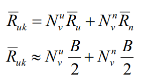
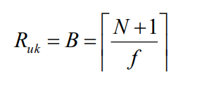
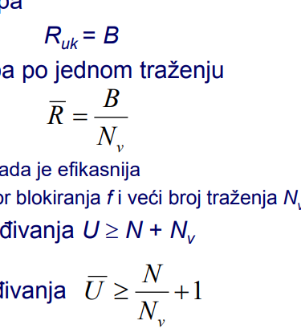
Обновление последовательного файла – в режиме последовательной обработки – формат записи файла Ds и Dn идентичен (k(Si), p(Si)) – формат записи файла изменений Dp: (k(Si),pp(Si),sp(Si)) • sp(Si) - поле статуса выполненной операции, возможные значения: – n – новая запись, m – данные для модификации, b – запись для удаления – формат записи файла ошибок Dg: (k(Si), p(Si), sg(Si)) • sg(Si) - поле описания ошибки, возможные значения указывают на: – попытку записи уже существующей записи в файл – попытку удаления или модификации несуществующей записи файла Обновление последовательного файла – в режиме последовательной обработки • последовательный доступ с загрузкой записей Ss(Ds) и Sp(Dp) • сравнение значений ключей текущих записей • генерация новых записей Sn(Dn) на основе содержимого текущих записей Ss и Sp • запись записей Sn в файл Dn – длина интервала между двумя обновлениями • определяется так, чтобы накопилось достаточное количество изменений, которое бы оправдало доступ ко всем записям старого и создание нового файла • более длинный интервал  более эффективная обработка, но и более долгий период несогласованности содержимого файла с реальным состоянием Обновление последовательного файла – в режиме последовательной обработки – файл изменений Dp содержит Nv = Nvn + Nvb + Nvm записей – Nvn для вставки, Nvb для удаления и Nvm для модификации – и Bv блоков: – существующий файл Ds содержит Bs блоков: – новый файл Dn содержит Bn блоков: Обновление последовательного файла – в режиме последовательной обработки – среднее количество доступов при обновлении файла за один поиск логически следующей записи
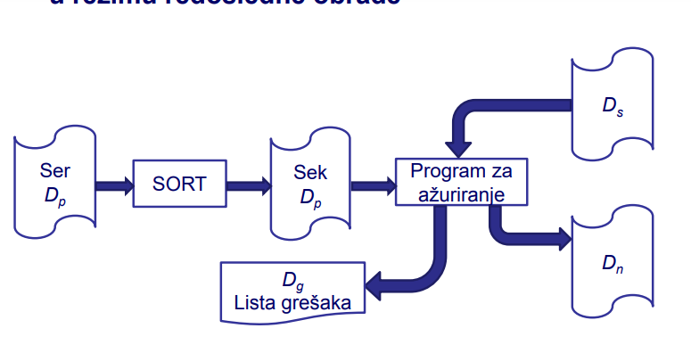
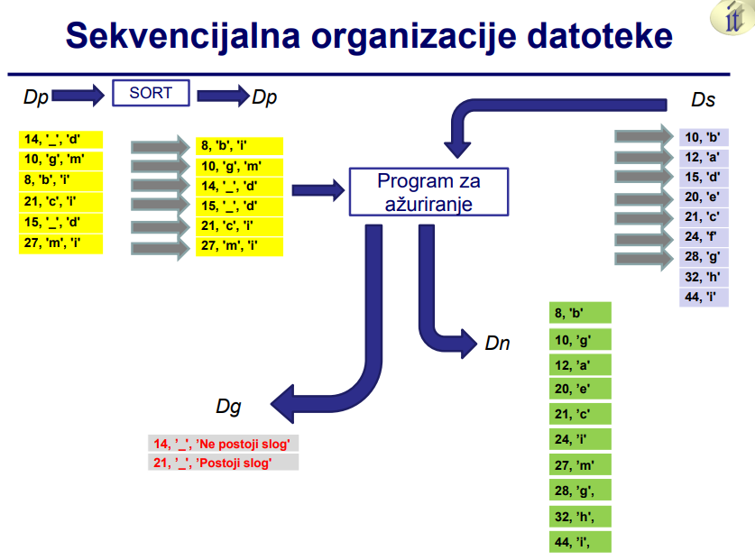
Области применения и оценка характеристик – преимущества • наилучшая физическая организация для последовательной обработки • экономичное использование пространства памяти • возможность использования как магнитной ленты, так и магнитного диска в качестве носителей данных – недостатки • неудобство для прямой обработки • необходимость сортировки при формировании • относительно длительный процесс обновления Области применения и оценка характеристик – наилучшая физическая организация для последовательной обработки • режим последовательной обработки часто используется на практике в пакетной (пакетной) обработке данных • это следствие того, что логически смежные записи расположены в физически смежных местах • загрузкой одного блока в ОЗУ получают f записей, которые, вероятно, участвуют в следующих этапах обработки • желательно, чтобы f было как можно больше • когда Nv  N, тогда R  1 / f, и с увеличением f улучшается эффективность обработки
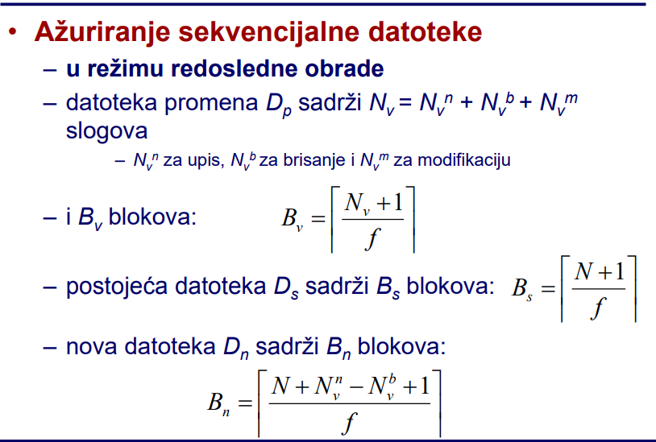
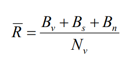
