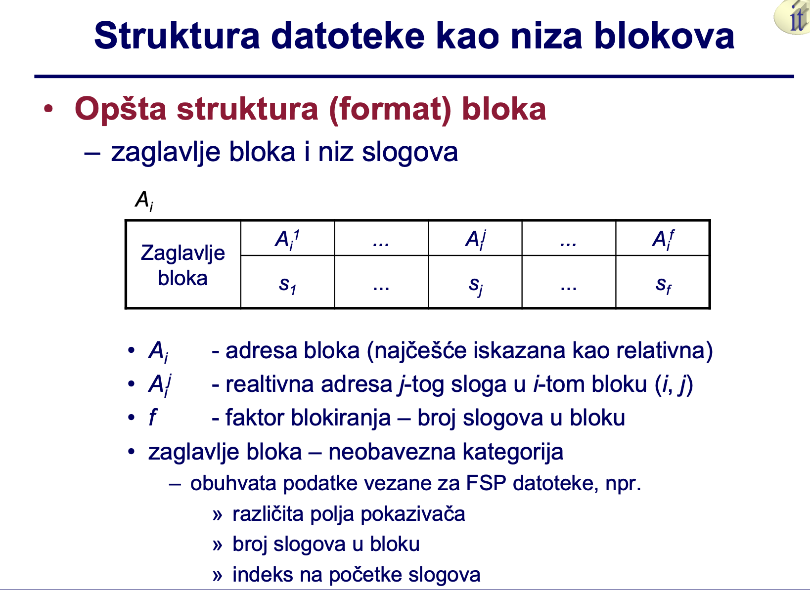
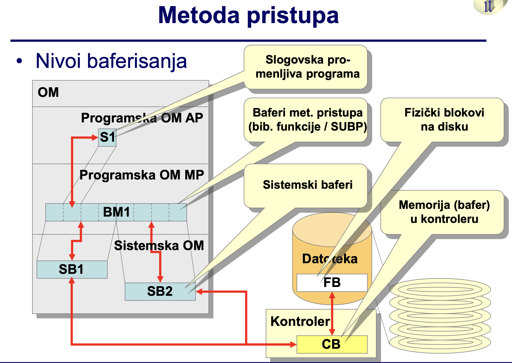
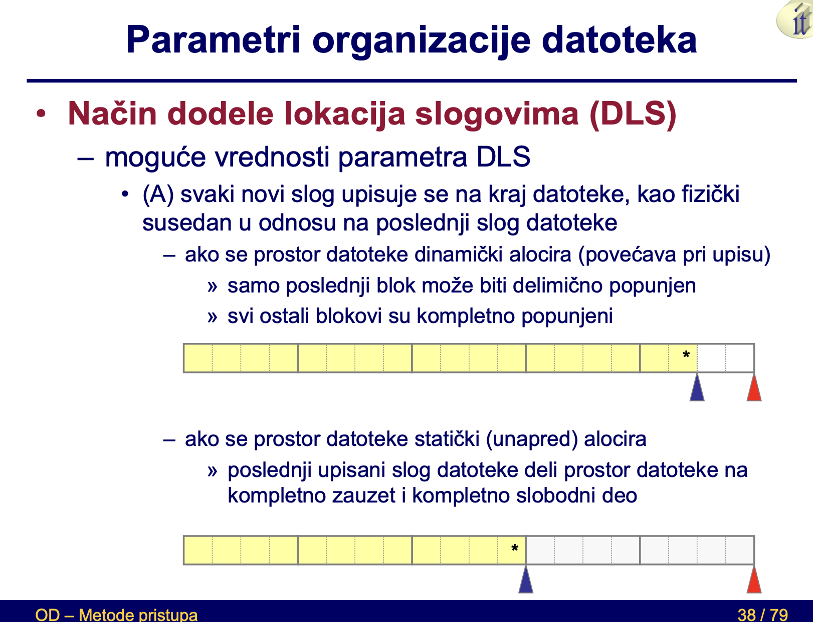
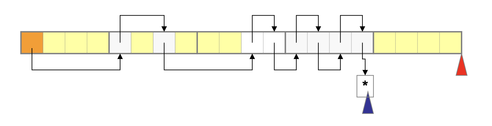
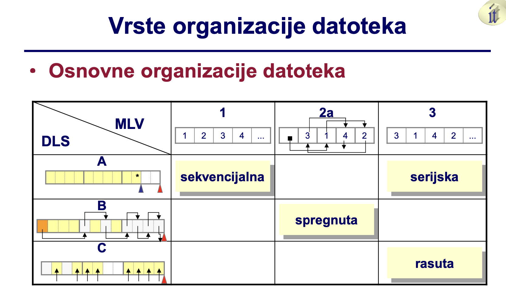
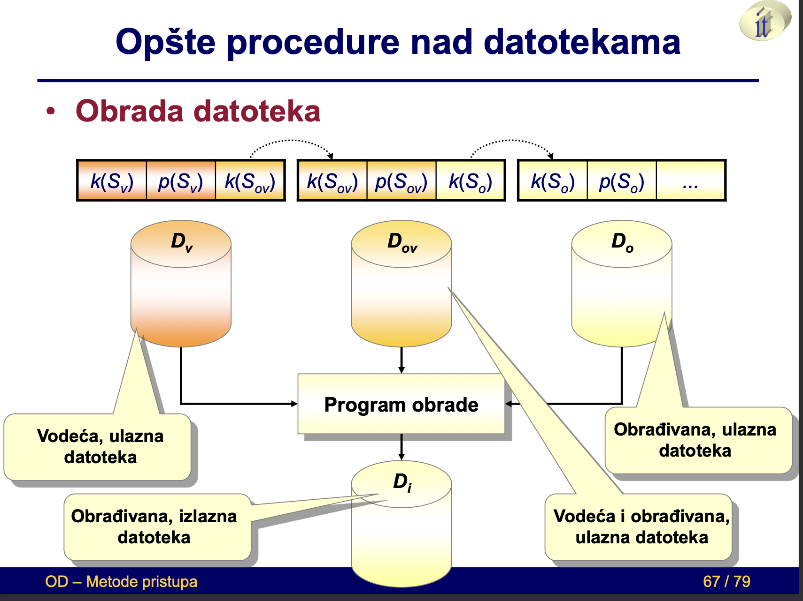
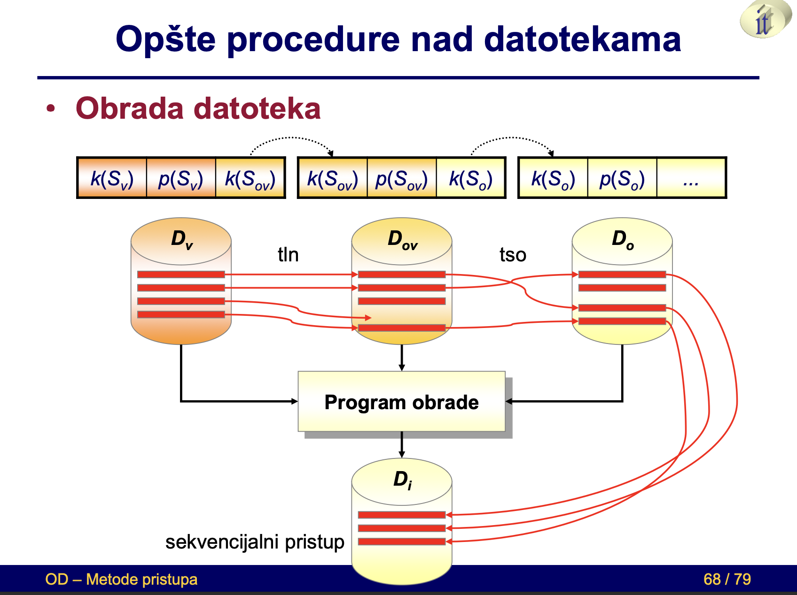
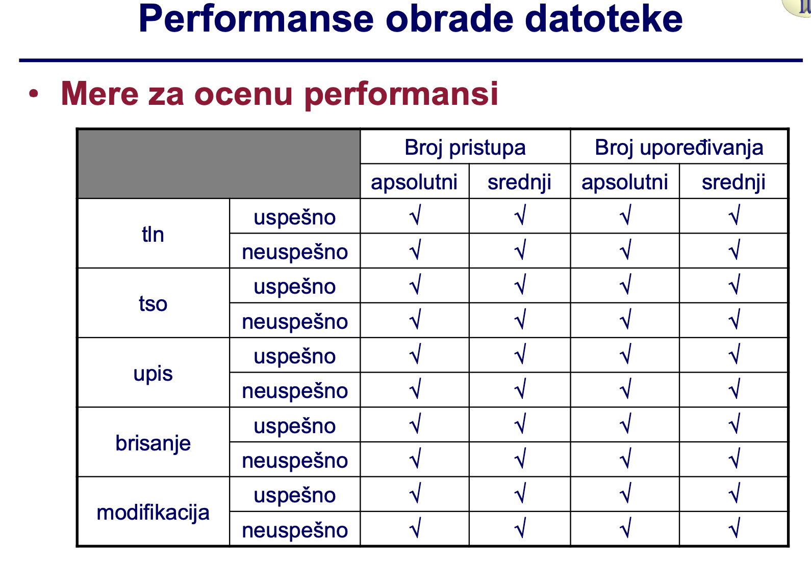

# **Файл как структура записей**

- *Организован по типу записи*
    - Как линейная структура атрибутов.

- *Общая структура файла как FSP (Физическая структура данных)*
    - Включает данные из LSP (Логическая Структура Данных) и данные об организации FSP на внешнем устройстве памяти.
  
    - Информация о структуре типа записи.

    - Информация о связях между записями (Не обязательно).

- *Каждая запись представляет собой последовательность полей со значениями атрибутов.*
  
- *Формат записи*
    - Правила для структурирования и интерпретации содержимого записи.

**Полная нотация (в памяти снизу вверх)**

| Заголовок                  | Описание                                      |
|----------------------------|-----------------------------------------------|
| $$ k1(S) ... kn(S) $$      | Поле значений атрибута первичного ключа       |
| $$ p1(S) ... pm(S) $$      | Поле статуса записи                           |
| $$ s(S) $$                 | Поле статуса записи                           |
| $$ u1(S)...uk(S) $$        | Поле указателя для сохранения связей          |
| $$ f1(S) ... fl (S) $$     | Контрольное поле для записей переменной длины |

**Краткая нотация (в памяти снизу вверх)**

| Заголовок                  | Описание                            |
|----------------------------|-------------------------------------|
| $$ k1(S) $$      | Поле значений атрибута первичного ключа       |
| $$ p1(S) $$      | Поле статуса записи                           |
| $$ s(S)  $$      | Поле статуса записи                           |
| $$ u1(S) $$      | Поле указателя для сохранения связей          |
| $$ f1(S) $$      | Контрольное поле для записей переменной длины |

**Основная структура файла**

- $k(S)$ представляет собой единственную обязательную группу полей:
  - Состоит как минимум из одного поля.

- Часто рассматривается как линейная структура записей:
  - Упорядочена в возрастающем или убывающем порядке значений первичного ключа.

- Порядок полей в формате записи не обязан совпадать с общей структурой записи:
  - Задается на предыдущем слайде.

- Позиция контрольных полей определяется их семантикой.
  
**Format поля записи**

- Условлен спецификацией домена соответствующего атрибута, то есть примененным типом данных.

**Виды полей в записях**

- *Поля фиксированной длины:*
  - Не требуется хранение информации о границах полей.

- *Поля переменной длины:*
  - Требуется хранение информации о границах полей.
  - Используется контрольное поле $f_i(S)$.
    - Техники:
      - Указание текущей длины поля в контрольном поле, непосредственно перед содержимым поля.
      - Указание специальной метки конца поля в контрольном поле, непосредственно после содержимого поля.

**Виды записей по длине**

- *Записи фиксированной длины:*
  - Все поля в каждой записи имеют постоянную длину.
  - Не требуется хранение информации о границах записи.

- *Записи переменной длины:*
  - Есть по крайней мере одно поле переменной длины в записи.
  - Требуется хранение информации о границах записи.
  - Используется контрольное поле $f_i(S)$.
    - Техники:
      - Указание текущей длины записи в контрольном поле, непосредственно перед остальным содержимым всей записи.
      - Указание специальной метки конца записи в контрольном поле, непосредственно после остального содержимого записи.
      - Введение специальной индексной структуры с порядковыми номерами байтов, указывающих на начала записей.

**Характеристики видов записей по длине**

- *Записи фиксированной длины:*
  - Появляются в практике.
  - Гомогенная структура.
  - Проще доступ и обновление данных.
  - Легче и более точно оценить производительность обработки данных.
  - Меньшая эффективность использования места в памяти.

- *Записи переменной длины:*
  - Исключительно часто появляются в практике.
  - Негомогенная структура.
  - Труднее доступ и обновление данных.
  - Труднее и менее точно оценить производительность обработки данных.
  - Большая эффективность использования места в памяти.

**О Видах Записей в Зависимости от Повторения Значений**

- *Записи с повторяющимися группами:*
  - Многократное появление значений атрибутов в одной записи.
  - Разрешено представление одного значения атрибута как последовательности значений того же типа.
  - Пример:
    - Тип сущности: `Student({StdID, ..., StdStrJez}, {StdID})`
    - Тип данных: `(StdStrJez : string(55))`
    - Возможное значение, трижды представленное (как три поля):
      - 'английский', 'французский', 'немецкий'
  - Всегда должны быть записи переменной длины.

- *Записи без повторяющихся групп:*
  - Запрещено многократное появление значений атрибутов.
  - Всегда можно спроектировать тип записи без повторяющихся групп, используя соответствующие проектировочные техники.

**Поля указателей в структуре записи**

- Представляют собой адреса расположения в памяти.

**Типы адресов расположения**

- *Абсолютный (машинный) адрес:*
  - Структурирован по адресному пространству блока диска.

- *Относительный адрес:*
  - Представляет собой порядковый номер местоположения.
  - Может сопровождаться номером подместоположения.
  - Примеры:
    - Порядковый номер блока, порядковый номер байта, (порядковый номер блока, порядковый номер байта в блоке).
    - Порядковый номер записи (в линейной структуре), (порядковый номер блока, порядковый номер записи в блоке).
  
- *Символический (ассоциативный) адрес:*
  - Значение ключа.

**Виды адресов расположения**

- *Абсолютный (машинный) адрес:*
  - Практически не используется в организации файлов.
  - Создает зависимость от физических характеристик устройства.
  - Не требует преобразований.

- *Относительный адрес:*
  - Очень часто используется в организации файлов.
  - Обеспечивает независимость от физических характеристик устройства.
  - Требует одно или несколько преобразований до абсолютного адреса.
  - На уровне метода доступа и/или системных вызовов.

- *Символический (ассоциативный) адрес:*
  - Часто используется в организации файлов.
  - Требует преобразования в относительный адрес.
  - На уровне метода доступа.

# Структура файла как массив блоков

**Блок (логический блок)**

- Как организационная единица данных:
  - Представляет собой последовательность записей.
  - Имеет постоянную вместимость.

- Типичные размеры: 2KB, 4KB, 8KB, 16KB.
  - Чаще всего представляет собой целочисленное кратное физического блока.

**Отношение блока – физического блока**

- Обычно один блок представляет собой последовательность из $2^n; (n \geq 0)$ физических блоков.
  - Не исключено, что емкость блока будет:
    - Равной емкости физического блока или
    - Меньше емкости физического блока.

**Общая структура (формат) блока**

- Заголовок блока и последовательность записей

| Заголовок | $A^{i}_{1}$ | ...  | $A^{i}_{j}$ | ...  | $A^{i}_{f}$ | 
|-----------|-------------|------|-------------|------|-------------|
| блока     |  $s_{1}$    |  ... |  $s_{i}$    |  ... |  $s_{f}$    |

Где:
- **Ai:** Адрес блока (обычно выражен как относительный).
- **Aij:** Относительный адрес j-ой записи в i-ом блоке (i, j).
- **f:** Фактор блокировки – количество записей в блоке.
- **Заголовок блока:** Необязательная категория, включающая данные, связанные с FSP файла, например:
  - Различные поля указателей.
  - Количество записей в блоке.
  - Индексы начал записей.

**Виды блоков**

- Блоки с записями переменной длины:
  - В один блок может быть помещено несколько записей.
  - Разрешено, чтобы размер одной записи превышал емкость блока.
  - В этом случае происходит цепочка блоков для одной записи.

- Блоки с записями фиксированной длины:
  - Гомогенная структура блока и файла.
  - Каждый блок файла всегда содержит одинаковое количество записей.
  - \(f\) - фактор блокирования файла.
  - \(B\) - общее количество блоков в файле.
  - \(N\) - общее количество записей в LSP файле.
    - \(B = \left\lceil\frac{N + x}{f}\right\rceil\), где \(x\) - количество дополнительно используемых специальных записей.

**Расчет необходимой емкости файла**

- Возможен при использовании блоков с записями фиксированной длины.
- \(K_s\) - емкость записи, сумма емкостей всех полей (фиксированной длины).
- \(K_b\) - емкость блока (заранее заданная константа).
- \(K_z\) - емкость заголовка блока (зависит от организации).
- \(f = \lfloor\frac{K_b - K_z}{K_s}\rfloor\) - фактор блокирования (округленный вниз).
- \(K_d\) - емкость файла (зависит от организации).
- \(W_d\) - ширина блока данных.

Формула для \(K_d\):
\[ K_d = B \cdot K_b + W_d \]

**Структура файла в виде последовательности блоков**

- Линейная структура блоков файла:
  - Каждый блок файла содержит последовательность записей файла.

- Строго структурированный файл:
  - Строго типизированный файл с присвоенной семантикой.
  - Организован как структура над множеством записей.

**Заголовок файла**

- Необходимо расширение основной структуры файла.
- Вводится специальная запись в начале файла.
  - Содержит информацию об организации файла и формате блока и записи файла.
  - Включает в себя данные, такие как:
    - Количество записей и/или блоков в файле.
    - Длина и формат записи.
    - Позиция ключевого поля в записи.
    - Указатели на начало связанных структур записей или блоков.

**Ознака конца файла**

- Способы обозначения конца файла в основной структуре:
  - (A) Введение специальной записи для обозначения конца файла:
    - Записывается в конце структуры, после последней записи в LSP, в первое свободное место в памяти файла.
  - (B) Введение специальной метки конца в поле указателя:
    - Указывается в поле указателя логически следующей записи \(u(S)\) последней записи в LSP.
  - (C) Введение специального учета занятого пространства:
    - Запоминание, например, количества занятых мест в пространстве, выделенном файлу.
    - Во вспомогательной структуре данных.
  - (D) Конец файла - конец пространства, выделенного файлу:
    - Не вводится специальный механизм для обозначения конца файла.

Пожалуйста, дайте мне знать, если нужны дополнительные пояснения или уточнения.

# Метод доступа

**Пакет программ (процедур) для поддержки услуг высокого уровня**

- Управление строго структурированными файлами:
  - Управление организацией и хранением полей, записей и блоков.
  - Различные виды услуг в отношении организации записи и блока.
  - Управление буферами методов доступа.
  
- Различные виды услуг в отношении организации записи и блока:
  - Возможно, имеется в виду различные виды организации данных и методов доступа.

- Управление буферами методов доступа:
  - Высший уровень "буферизации" по сравнению с уровнем системных буферов.
  
**Примечание:**
  - Текст не предоставляет конкретных деталей о том, как именно реализованы эти услуги высокого уровня. Возможно, он представляет собой описание пакета программ или процедур, которые предназначены для обеспечения эффективного управления структурированными файлами и буферами на более высоком уровне абстракции.
  
**Пакет программ (процедур) для поддержки услуг высокого уровня**

- Поддержка различных видов организации файлов:
  - Обеспечение различных методов организации файлов для эффективного управления данными.

- Поддержка различных методов хранения логических связей и адресации (доступа к данным):
  - В строго структурированных файлах.
  
- Забота о категориях:
  - Заголовок файла.
  - Начало и конец файла.
  - Текущий указатель, индикатор актуальности.
    - Выражен в виде относительного адреса блока или записи, на котором выполняется операция (или, как альтернатива, где была выполнена предыдущая операция).

- Поддержка создания специальных вспомогательных структур для повышения эффективности обработки данных.

**Примечание:**
  - Текст указывает на то, что пакет программ предоставляет поддержку различных методов организации данных и обеспечивает удобные механизмы для работы с категориями, заголовками и указателями в файле.

**Пакет программ (процедур) для поддержки услуг высокого уровня**

- Поддержка общих процедур управления содержимым файлов:
  - Создание, поиск, обзор, обновление и реорганизация.
  - Использует или включает услуги низкого уровня выбранной операционной системы.
  - В зависимости от места и способа реализации метода доступа.
  
- Обеспечивает независимость прикладной программы от услуг низкого уровня операционной системы.
  
- Обеспечивает отображение строго структурированного файла в последовательность физических блоков.
  
- Обеспечивает преобразование относительного адреса записи или блока файла в относительный адрес байта или физического блока.

**Примечание:**
  - Текст указывает на то, что этот пакет программ обеспечивает высокоуровневую поддержку для общих процедур управления файлами и при этом использует или интегрирует услуги низкого уровня операционной системы. Это способствует независимости прикладного программного обеспечения от конкретных деталей реализации методов доступа и обеспечивает эффективное управление содержимым файлов.

**Управление строго структурированными файлами**

- Поддержка организации записей и полей:
  - Записи постоянной длины.
  - Записи переменной длины.

- Поддержка различных типов данных:
  - Алфавитно-цифровые, даты, битово-ориентированные, мультимедийные и другие.

- Поддержка различных кодировок:
  - Обеспечение работы с различными схемами кодирования.

- Конверсии данных:
  - Из переменных программных данных в атрибут типа данных файла и наоборот.
  - Из типа данных атрибута строго структурированного файла в массив байтов и наоборот.

**Примечание:**
  - Текст указывает на то, что этот пакет программ обеспечивает управление строго структурированными файлами, предоставляя поддержку различных организаций записей и полей, различных типов данных, кодировок и конверсий данных. Это обеспечивает гибкость и адаптивность для работы с разнообразными типами данных в файловой системе.

- **Услуги обмена данными с прикладной программой на уровне записи:**
  - Группировка записей в блоки при записи данных.
  - Разбиение блока на записи при чтении данных.
  - Поддержание текущего указателя в виде относительного адреса записи:
    - Порядковый номер записи в файле.
  - Трансформация этого адреса в форму:
    - (Порядковый номер блока в файле, Порядковый номер записи в блоке).
    
- **На уровне блока:**
  - Обмен содержимым целых логических блоков между прикладной программой и файлом.
  - Поддержание текущего указателя в виде относительного адреса блока в форме:
    - Порядковый номер блока в файле.

**Примечание:**
  - Текст указывает на то, что этот пакет программ обеспечивает эффективный обмен данными между прикладной программой и файлом на уровне как записи, так и блока. Также осуществляется поддержание текущих указателей в виде относительных адресов, что упрощает процессы записи и чтения данных.

**Управление строго структурированными файлами**

- **Услуги доступа к данным из прикладных программ:**
  - **Последовательный (последовательный) доступ:**
    - К записям или блокам файла.
    - Обычно к записям файла.
    - Автоматическое поддержание (инкремент) значения текущего указателя:
      - При операциях загрузки/записи данных.
      
  - **Прямой доступ:**
    - К записям или блокам файла.
    - Требует явного задания значения текущего указателя:
      - Порядковый номер записи или блока файла.
      - При операциях позиционирования.
      
  - **Динамический (комбинированный) доступ:**
    - Комбинация прямого и последовательного доступа.

**Примечание:**
  - Эти службы обеспечивают доступ к данным из прикладных программ с использованием последовательного, прямого и динамического доступа. Последовательный доступ автоматически поддерживает текущий указатель при операциях чтения/записи, в то время как прямой доступ требует явного задания текущего указателя. Динамический доступ представляет собой комбинацию обоих подходов.

**Управление строго структурированными файлами**

- **Вызовы процедур метода доступа:**
  - Открытие и закрытие файла.
  - Загрузка и вывод содержимого записи или блока.
  - Позиционирование на запись или блок файла.
  - Проверка статуса файла.
  - Создание, удаление файла и т. д.
  
- **Принимают параметры вызова из вызывающей среды - прикладной программы:**
  - Путь и имя файла (открытие файла).
  - Метка файла (процедуры с открытым файлом).
  - Метка переменной в рабочей области программы.
  
- **Передают в вызывающую среду информацию о статусе выполнения процедуры метода доступа:**
  - Основание для обработки исключений.

**Примечание:**
  - Эти вызовы процедур метода доступа осуществляют управление строго структурированными файлами и принимают параметры от прикладной программы. Они также передают информацию о статусе выполнения для обработки исключений в вызывающей среде.

**Окружения, включающие методы доступа**

- **Операционная система:**
  - Осуществляет управление методами доступа к файлам в рамках своей функциональности.
  
- **Язык программирования с соответствующими пакетами (библиотеками) функций:**
  - Предоставляет средства для реализации методов доступа в рамках прикладных программ.

- **Система управления базами данных:**
  - Осуществляет контроль за методами доступа к данным в базах данных.
  
- **Некоторые службы метода доступа могут быть реализованы напрямую в прикладной программе.**

**Примечание:**
  - Различные среды, такие как операционные системы, языки программирования и системы управления базами данных, предоставляют собой разнообразные методы доступа к файлам. В некоторых случаях, службы метода доступа могут быть реализованы и внутри прикладных программ.

**Окружения, включающие методы доступа:**

- **Операционная система:**
  - **Старые операционные системы "mainframe" компьютеров:**
    - Не было явного разделения на службы ОС низкого и высокого уровня.
    - Службы метода доступа, такие как файловые системы, были видны как "монолитная" структура.
    - Первые подпрограммы (SUBP) возникали на основе явного использования таких служб метода доступа.
    - Поддерживали управление блоками и буферами метода доступа.
    - Блок = Control Interval (CI).
    - Позволяли явное объявление формата блока (и, следовательно, емкости буфера) на уровне отдельного файла.
  - **Часто комбинировали вызовы служб метода доступа с языками программирования, такими как Cobol или PL/I (IBM).**

**Примечание:**
  - В старых операционных системах "mainframe" компьютеров часто не было явного разделения на службы ОС низкого и высокого уровня. Службы метода доступа были видны как единая структура, и подпрограммы разрабатывались на основе их использования.

  **Окружения, включающие методы доступа:**

- **Программный язык с присоединенными пакетами (библиотеками) функций:**
  - Практически каждый современный язык программирования (например, C, Java) предоставляет определенные службы метода доступа, которые могут быть:
    - Встроены в сам язык или
    - Включены в определенные пакеты (библиотеки) функций, "упакованные" и поставляемые вместе с компилятором и средой разработки (например, для C - stdio.h) или
    - Поставляются независимо от самого языка/компилятора.
  - Явно используют службы низкого уровня выбранной операционной системы.
  - Обычно предоставляют только услуги на уровне записи файла.
    - Управление блоками и буферами скрыто от прикладной программы.
    - Буферы библиотечных функций имеют постоянную емкость (в C определено в stdio.h) и недоступны прикладной программе.

**Окружения, включающие методы доступа:**

- **Система управления базами данных:**
  - Каждая СУБД обязательно предоставляет службы метода доступа.
  - Обычно не используются напрямую из прикладных программ, а предоставляются другим модулям внутри СУБД.
  - Эксплицитно используют службы низкого уровня выбранной операционной системы.
  - В некоторых ситуациях возможно обходить службы низкого уровня ОС, когда СУБД напрямую управляет физическим обменом данными между файлом на диске (raw device) и ОЗУ.
  - Поддерживают управление блоками и буферами метода доступа.
    - Блок базы данных (Database Block).
    - Позволяют явно объявлять емкость блока/буфера на уровне установки СУБД.
      - Единообразно для всех файлов, которыми управляет СУБД.

**Управление буферами метода доступа:**

- **Окружение, в котором реализован метод доступа, обеспечивает управление задачами буферизации:**
  - Выделение и освобождение буферов.
  - Ведение учета содержимого буферов.
- Три уровня "буферизации" данных файла в ОЗУ:
  - **Уровень системских буферов:**
    - Управляется операционной системой.
  - **Уровень буферов метода доступа:**
    - Управляется окружением, в котором реализован метод доступа.
  - **Уровень переменных местоположений в прикладной программе:**
    - Управляется прикладной программой.

**Организация данных**

- Проектирование логической структуры атрибутов (ЛСА).
- Проектирование и реализация СПС (строго структурированных файлов) в контексте:
  - Заданных ЛСА.
  - Системной архитектуры.
- С целью обеспечения:
  - Удовлетворения потребностей пользователей.
  - Условий для эффективной обработки данных.

**Результат организации данных**

- Система базы данных или
- Система файлов.

**Проект и реализация FSP**

- Выбор метода назначения местоположений для записей.
- Выбор метода хранения логических связей между записями в LSP (строгой структуре файлов).
- Проектирование основных структур данных.
- Проектирование вспомогательных структур данных.
- Расчет и выделение необходимого пространства на внешних устройствах хранения.
- Размещение записей с связями на внешних устройствах хранения.
- Расчет, отслеживание и анализ производительности процедур обработки данных.

**Организация файла**

- Проектирование LSO (логической структуры файла) сводится к проектированию типа сущности N(Q, C), то есть типа записи.
- Выбор типа организации файла (основных и вспомогательных структур) зависит от значений параметров.
  - Метод назначения местоположений записям, который также определяет метод регистрации свободного и занятого пространства в файле.
- Метод хранения логических связей между записями в LSP (строгой структуре файлов).

**Способ присвоения расположений записям (DLS)**

- Возможные значения параметра DLS:
  - (A) Каждая новая запись добавляется в конец файла, как физически смежная с последней записью в файле.
    - Если пространство файла аллоцируется динамически (увеличивается при записи):
      - Только последний блок может быть частично заполнен.
      - Все остальные блоки полностью заполнены.
      

    - Если пространство файла аллоцируется статически (заранее):
      - Последняя добавленная запись в файл разделяет пространство файла на полностью занятую и полностью свободную части.
      

**Основная структура файла**
• Основная структура файла
  - k(S) представляет собой единственную обязательную группу полей
    • состоит по крайней мере из одного поля
  - часто рассматривается как линейная структура записей
    • упорядочена по возрастанию или убыванию значений первичного ключа
  - порядок полей в формате записи не обязательно такой же, как в
    общей структуре записи
    • данной на предыдущем слайде
    • позиция контрольных полей зависит от их семантики
**Формат поля записи**
  - условлен спецификацией домена соответствующего
    атрибута, или применяемым типом данных
  - Виды полей в записях
    - поля постоянной длины
      • не требуется хранить информацию о границах поля
    - поля переменной длины
      • требуется хранить информацию о границах поля
      - используется контрольное поле fi(S)
    • техники
      - указание текущей длины поля в контрольном поле, непосредственно перед содержимым поля
      - указание специальной метки конца поля в контрольном поле, непосредственно после содержимого поля
**Виды записей по длине**
  - записи постоянной длины
    • появляются на практике
    • однородная структура
    • более простой доступ к данным и обновлению данных
    • более легкая и точная оценка производительности обработки данных
    • меньшая эффективность использования пространства памяти
  - записи переменной длины
    • чрезвычайно часто встречаются на практике
    • неоднородная структура
    • более сложный доступ к данным и обновлению данных
    • более сложная и менее точная оценка производительности обработки данных
    • более высокая эффективность использования пространства памяти
**Виды записей по повторению значений**
  - записи с повторяющимися группами
    • многократное появление значений атрибута в одной записи
    • когда разрешено, что одно значение атрибута может быть
    представлено как последовательность значений того же типа
    • пример
      - тип сущности: Студент({StdID, ..., StdStrJez}, {StdID})
      - тип данных: (StdStrJez : string(55))
      - возможное значение, трижды указанное (как три поля)
      - 'английский', 'французский', 'немецкий'
    • всегда должны быть записи переменной длины
  - записи без повторяющихся групп
    • запрещено многократное появление значений атрибута
    • всегда можно спроектировать тип записи без повторяющихся групп
    - применением соответствующих проектировочных техник
**Поля указателей в структуре записи**
  - представляют адреса расположения в пространстве памяти
**Виды адресов расположения**
  - абсолютный (машинный) адрес
    • практически не используется в организации файлов
    • создает зависимость от физических характеристик устройства
    • не требует преобразования
  - относительный адрес
    • очень часто используется в организации файлов
    • обеспечивает независимость от физических характеристик устройства
    • требует одного или нескольких преобразований в абсолютный адрес
    - на уровне метода доступа и/или системных вызовов
  - символический (ассоциативный) адрес
    • часто используется в организации файлов
    • требует преобразования в относительный адрес
    - на уровне метода доступа

**Структура файла в виде блоков**
• Общая структура (формат) блока
  - заголовок блока и массив записей
• Ai - адрес блока (чаще всего выражен как относительный)
• Aij - относительный адрес j-й записи в i-м блоке (i, j)
• f - фактор блокирования – количество записей в блоке
• заголовок блока – необязательная категория
  - включает данные, связанные с FSP файлом, например:
    • различные поля указателей
    • количество записей в блоке
    • индекс на начала записей
    

**Виды блоков**
- блоки с записями переменной длины
  • в одном блоке может содержаться несколько записей
  • допускается, что размер одной записи превышает емкость блока
    - затем происходит цепочка блоков одной записи
- блоки с записями константной длины
  • однородная структура блока и файла
  • каждый блок файла всегда содержит одинаковое количество записей
  • f – фактор блокирования файла
  • B – общее количество блоков файла
  • N – общее количество записей в LSP файле
B = (N + x) / f
  - x – количество дополнительно использованных специальных записей
**Расчет необходимой емкости файла**
- возможен в случае использования блоков с записями константной длины
  • Ks - емкость записи
    - представляет собой сумму емкостей всех полей (константной длины)
  • Kb – емкость блока (заранее заданная константа)
  • Kz – емкость заголовка блока (зависит от организации)
f = (Kb - Kz) / Ks 
  • Kd – емкость файла (зависит от организации)
Kd = BKb + Wd
  • Wd – емкость STD для файла

# Структура файла в виде последовательности блоков
## Метка конца файла
### Способы обозначения конца файла в основной структуре

1. (A) Введение специальной записи для обозначения конца файла:
   - Записывается в конце структуры, за последней записью в LSP, в первую свободную область памяти файла.

2. (B) Введение специальной метки конца в поле указателей:
   - Указывается в поле указателей логически следующей записи u(S) у последней записи в LSP.

3. (C) Ведение отдельного учета занятого пространства:
   - Запись, например, количества занятых мест в пространстве, выделенном для файла.
   - В дополнительной структуре данных.

4. (D) Конец файла равен концу выделенного для файла пространства:
   - Не вводится отдельный механизм обозначения конца файла.

ОД – Методы доступа 20 / 79

## Содержание
• [Основная структура файла](#основная-структура-файла)
• [Структура файла как последовательности блоков](#структура-файла-как-последовательности-блоков)
• [Метод доступа](#метод-доступа)
• [Параметры организации файлов](#параметры-организации-файлов)
• [Виды организации файлов](#виды-организации-файлов)
• [Общие процедуры работы с файлами](#общие-процедуры-работы-с-файлами)
• [Производительность обработки файла](#производительность-обработки-файла)

ОД – Методы доступа 21 / 79

# Метод доступа

## Пакет программ (процедур), обеспечивающих поддержку высокоуровневых услуг
– Управление строго структурированными файлами
• Управление организацией и памятью полей, записей и блоков
– Различные виды услуг по организации записи и блока
– Управление буферами метода доступа
• Уровень буферизации выше по сравнению с системными буферами

OD – Методы доступа 22 / 79

## Пакет программ (процедур) для поддержки высокоуровневых услуг
– Поддержка различных типов организации файлов
• Поддержка различных способов хранения логических связей и
адресации (доступа к данным)
– В строго структурированных файлах
• Управление категориями
– Заголовок файла
– Начало и конец файла
– Текущий указатель, индикатор актуальности
» Выражен как относительный адрес блока или записи, на которой
выполняется операция (или, альтернативно, на которой была
выполнена предыдущая операция)
• Поддержка построения специальных вспомогательных структур для
улучшения эффективности обработки данных

OD – Методы доступа 23 / 79

# Метод доступа

## Управление строго структурированными файлами
– Поддержка организации записей и полей
• Записей фиксированной длины
• Записей переменной длины
– Поддержка различных типов данных (алфавитных, дат, биториентированных, мультимедийных)
– Поддержка различных кодировок
– Конвертация данных
• Из программно-изменяемого типа данных в тип данных атрибута файла и обратно
• Из типа данных атрибута строго структурированного файла в последовательность байтов и обратно

OD – Методы доступа 25 / 79

## Управление строго структурированными файлами
– Услуги обмена данными с прикладной программой
• На уровне записи
– Группировка записей в блоки при записи данных
– Разбиение блока на записи при чтении данных
– Поддержка текущего указателя в виде относительного адреса записи
» Номер записи в файле
– И его трансформация в форму
» (Номер блока в файле, Номер записи в блоке)
• На уровне блока
– Обмен содержимым целых логических блоков между
прикладной программой и файлом
– Поддержка текущего указателя в виде относительного адреса блока, в
форме
» Номер блока в файле

OD – Методы доступа 26 / 79

# Метод доступа

## Управление строго структурированными файлами
– Службы доступа к данным из прикладных программ
• Последовательный (последовательный) доступ
– К записям или блокам файла
» Обычно к записям файла
– Автоматически поддерживают (инкрементируют) значение текущего
указателя
» При операциях загрузки / выгрузки данных
• Прямой доступ
– К записям или блокам файла
– Требует явного указания значения текущего указателя
» Номер записи или блока файла
» При операциях позиционирования
• Динамический (комбинированный) доступ
– Комбинация прямого и последовательного доступа
OD – Методы доступа 27 / 79

## Управление строго структурированными файлами
– Вызовы процедур метода доступа
• Открытие и закрытие файла
• Загрузка и выгрузка содержимого записи или блока
• Позиционирование на запись или блок файла
• Проверка статуса файла
• Создание, удаление файла и т. д.
– Принимают параметры вызова из вызывающей среды - прикладной программы
» Путь и имя файла (открытие файла)
» Метка файла (процедуры над открытым файлом)
» Метка переменной в области программы
– Передают в вызывающую среду информацию о статусе
выполнения процедуры метода доступа
» Основание для обработки исключений

# Метод доступа

## Окружения, включающие методы доступа
– Операционная система
– Язык программирования с соответствующими пакетами
(библиотеками) функций
– Система управления базами данных
• Некоторые службы метода доступа могут быть
реализованы непосредственно в прикладной программе
OD – Методы доступа 29 / 79

## Окружения, включающие методы доступа
– Операционная система
• Обычно старые операционные системы "mainframe"
• Не существовало явного разделения на службы низкого и
высокого уровня ОС
– Службы метода доступа, т.е. файловая система, видимы как "монолитная"
структура
– Первые SUBP появились на основе явного использования таких
служб метода доступа
• Поддерживали управление блоками и буферами метода доступа
– Block = Control Interval (CI)
– Позволяли явно объявлять формат блока (и, следовательно, объем буфера) на уровне
каждого отдельного файла
• Вызовы служб метода доступа часто комбинировались с
программными языками Cobol или PL/I (IBM)

# Метод доступа

## Окружения, включающие методы доступа
– Программный язык с соответствующими пакетами
(библиотеками) функций
• Практически каждый современный язык программирования (например, C, Java)
предоставляет определенные службы метода доступа, которые могут быть
– Встроены в сам язык или
– Включены в определенные пакеты (библиотеки) функций
» "Упакованы" и поставляются вместе с компилятором и
средой разработки (например, для C, stdio.h) или
» Поставляются независимо от самого языка / компилятора
• Явным образом используют службы низкого уровня выбранной ОС
• Обычно предоставляют только службы на уровне записи файла
– Управление блоками и буферами скрыто от прикладной
программы
» Буферы библиотечных функций имеют постоянный объем (в C
определен в stdio.h) и недоступны прикладной программе
OD – Методы доступа 31 / 79

## Окружения, включающие методы доступа
– Система управления базами данных
• Каждый SUBP обязательно предоставляет службы метода доступа
– Обычно они не используются непосредственно из прикладных программ
– Уже доступны другим модулям внутри SUBP
• Явным образом использует службы низкого уровня выбранной ОС
– Возможно, в специфических ситуациях SUBP может
"обойти" службы низкого уровня ОС
» Тогда SUBP напрямую управляет физическим обменом
данными между файлом на диске (raw device) и ОМ
• Поддерживает управление блоками и буферами метода доступа
– Database Block
– Позволяет явно объявлять объем блока / буфера на уровне
установки SUBP
» Однородно для всех файлов, которыми управляет SUBP

# Метод доступа

## Управление буферами метода доступа
– Окружение, в котором реализован метод доступа, заботится о задачах управления буферами
• Выделение и освобождение буферов
• Ведение учета содержимого буферов
– Три уровня "буферизации" данных файла в ОМ
• Уровень системных буферов
– Которыми управляет ОС
• Уровень буферов метода доступа
– Которыми управляет окружение, в котором реализован метод
доступа
• Уровень местоположений переменных в прикладной программе
– Которыми управляет прикладная программа

# Содержание

- Основная структура файла
- Структура файла как последовательности блоков
- Метод доступа
- Параметры организации файла
- Типы организации файлов
- Общие процедуры работы с файлами
- Производительность обработки файла

# Параметры организации файла

## Организация данных
- Проектирование логической структуры атрибутов (ЛСО)
- Проектирование и реализация FSP в контексте
  - Запроектированных ЛСО и
  - Системной архитектуры
- С целью обеспечения
  - Удовлетворения потребностей пользователей
  - Условий для эффективной обработки данных

## Результат организации данных
- Система базы данных или
- Файловая система

# Проект и реализация FSP
- Выбор способа выделения местоположений для записей
- Выбор способа сохранения логических связей между записями в ЛСО
- Проектирование основных структур данных
- Проектирование вспомогательных структур данных
- Расчет и резервирование необходимого пространства на внешних устройствах хранения
- Размещение записей с связями на внешних устройствах хранения
- Расчет, отслеживание и анализ производительности процедур обработки данных

# Параметры организации файла

## Организация файла
- Проектирование ЛСО сводится к проектированию типа сущности N(Q, C), т.е. типа записи
- Выбор типа организации файла (основных и вспомогательных структур) зависит от значений параметров
  - Способ выделения местоположений для записей
    - Также влияет на способ отслеживания свободного и занятого пространства в файле
  - Способ сохранения логических связей между записями в ЛСО

# Способ выделения местоположений для записей (СВМ)
- Возможные значения параметра СВМ
  - (A) Каждая новая запись добавляется в конец файла, как физически смежная с последней записью в файле
    - Если пространство в файле динамически выделяется (увеличивается при записи)
      - Только последний блок может быть частично заполнен
      - Все остальные блоки полностью заполнены
    - Если пространство в файле статически (заранее) выделяется
      - Последняя запись файла делит пространство файла на полностью занятую и полностью свободную части

# страница 38 рисунок

# Параметры организации файла

## Способ выделения местоположений для записей (СВМ)
- Возможные значения параметра СВМ
  - (A) Каждая новая запись добавляется в конец файла, как физически смежная с последней записью в файле
    - Если пространство в файле динамически выделяется (увеличивается при записи)
      - Только последний блок может быть частично заполнен
      - Все остальные блоки полностью заполнены
    - Если пространство в файле статически (заранее) выделяется
      - Последняя запись файла делит пространство файла на полностью занятую и полностью свободную части
  - (B) Каждая новая запись получает первое свободное место из связанной линейной структуры свободных мест
    - Пространство в файле всегда статически (заранее) выделяется
      - Не вызывается каждый раз при добавлении новых записей в файл
    - Индекс в список свободных мест сохраняется в заголовке файла
    
    

# страница 39 рисунок

# Параметры организации файла

## Настройка выделения местоположений для записей (СВМ)
- Возможные значения параметра СВМ
  - (C) Каждая новая запись получает свободное место, чей относительный адрес является функцией значения ключа
    - Пространство в файле всегда статически (заранее) выделяется
      - Независимо от добавления новых записей в файл
    - Возможно только для записей постоянной длины
    - Функция преобразования значения ключа
      - Хеш-функция (аналитическое преобразование) или
      - Таблично заданная с использованием вспомогательной структуры

## Настройка хранения логических связей (НЛС)
- Между записями в LSP
- Возможные значения параметра НЛС
  - (1) Физическое позиционирование
    - Логически смежные записи размещаются в физически смежных местоположениях
  - (2) Использование указателей в качестве относительных адресов
    - Указатель хранит относительный адрес логически смежной записи
    - (2a) Поля указателей встроены в основную структуру
      - Каждая запись основной структуры файла расширяется как минимум одним полем указателя
    - (2b) Поля указателей встроены во вспомогательные структуры
      - Вводится как минимум одна вспомогательная структура, так называемая индексная структура
      - Часто представляет собой дерево с форматом записи в виде пары или n-кортежа (поля идентификатора записи, поля указателя)

# Параметры организации файла

## Настройка хранения логических связей (НЛС)
- Между записями в LSP
- Возможные значения параметра НЛС
  - (3) Логические связи не сохраняются
    - В FSP отсутствуют данные о логически смежных записях
    - Данные о логически смежных записях можно создать только
      - С использованием специальных программ по запросу пользователя
      - Программы для редактирования (сортировки) файлов

## Содержание
- Основная структура файла
- Структура файла в виде последовательности блоков
- Метод доступа
- Параметры организации файла
- Виды организации файлов
- Общие процедуры работы с файлами
- Производительность обработки файла

# Виды организации файлов

## Основные виды организации файлов
- **Основные организации**
  - Организация файла сводится к основной организации
  - FSP над набором записей организован в одной
    области памяти
    - Часто это является одним файлом операционной системы

- **Сложные организации**
  - Получаются путем комбинирования основных организаций
  - FSP включают как минимум две области памяти
    - Которые могут быть как минимум двумя файлами
      операционной системы
    - Основная FSP может быть размещена в одной или
      более областях
    - Могут появиться дополнительные структуры данных,
      размещенные в отдельных областях

## Содержание
- Основная структура файла
- Структура файла в виде последовательности блоков
- Метод доступа
- Параметры организации файла
- Виды организации файлов
- Общие процедуры работы с файлами
- Производительность обработки файла

# Типы организации файлов

## Сложные организации файлов
- **Распределенные (hash) с областью переполнения**
  - Основная зона - базовая структура
    - Основная распределенная организация
  - Зона переполнения - продолжение базовой структуры
    - Связанная или последовательная организация
    - Статические индексные (индекс-последовательные)
      - Основная зона - базовая структура
        - Последовательная организация
      - Зона переполнения - продолжение базовой структуры
        - Связанная организация
        - Зона индекса - вспомогательная структура
          - Связанная организация
            - Связывание в виде n-арного дерева поиска

- **Динамические индексные (организации с B-деревом)**
  - Основная зона - базовая структура
    - Связанная или последовательная организация
  - Зона индекса - вспомогательная структура
    - Связанная организация
      - Связывание в виде одной из вариантов B-дерева
# Типы организации файлов

## Виды организации файлов
- **Физические организации файлов**
  - **В системах файлов**
    - Каждый файл в системе файлов появляется как один или несколько отдельных файлов ОС.
  - **Физические организации таблиц**
    - В системах баз данных
      - Каждая таблица в БД может быть распределена в несколько файлов данных, управляемых SUBP.
      - В одном файле данных, управляемом SUBP, может быть размещено несколько таблиц БД.

# Общие процедуры работы с файлами

## Типы операций с файлами LSP
- **Создание файла**
  - Процесс создания FSP файла
    - С размещением записей на внешнем устройстве хранения
    - Согласно проектированной организации
    - На основе содержимого другой структуры данных
  - Включает в себя получение данных из других файлов или
  - Прямое задание данных со стороны пользователя
  - Два типа файлов
    - Файлы, создаваемые в отдельном процессе
      - Чаще всего: последовательные, связанные, статические рассыпанные, статические индексные
    - Файлы, создаваемые в процессе обычного обновления (записи новых записей)
      - Чаще всего: серийные, индексные с B-деревьями, динамические рассыпанные

# Операции над файлами

Общие файловые процедуры
• Виды процедур (операций) над файлами LSP.
– создание файла
- доступ к файлу
– поиск в файле
– поиск в файле
— обработка файлов
— обновление файла
— реорганизация файлов

## Формирование файла
- Создание FSP файла
  - Размещение записей на внешнем устройстве хранения
  - Согласно проектной организации
  - На основе другой структуры данных
    - Включает получение данных из других файлов или
    - Прямое задание данных пользователя
  - Два типа файлов
    - Файлы, создаваемые в отдельном процессе
      - Чаще всего: последовательные, связанные, статические рассыпанные, статические индексные
    - Файлы, создаваемые в процессе обычного обновления (записи новых записей)
      - Чаще всего: серийные, индексные с B-деревьями, динамические рассыпанные

## Операции с файлами
1. **Доступ к файлу**
   - Операции доступа к файлам, которые могут выполнять приложения
   - Зависит от выбранной методики доступа и организации файла

2. **Поиск в файле**
   - Операции поиска в файле для поиска конкретных записей по ключу или другим критериям
   - Зависит от выбранной методики доступа и организации файла

3. **Просмотр в файле**
   - Операции просмотра файла для чтения данных без изменения или удаления
   - Может быть последовательным или случайным

4. **Обработка файлов**
   - Операции для обработки данных в файле, например, сортировка или группировка

5. **Обновление файла**
   - Операции для изменения данных в файле, включая добавление, изменение и удаление записей

6. **Реорганизация файла**
   - Операции для изменения структуры файла для оптимизации производительности или использования ресурсов

• Доступ к файлу
  – Процедура позиционирования на нужное местоположение
    • записи или блока файла
  – Виды доступа
    • последовательный доступ
      – автоматическое поддержание относительного адреса текущего указателя
      – операция относится к соседнему местоположению по отношению к местоположению предыдущей операции
    • прямой доступ
      – явное указание относительного адреса текущего указателя, который указывает на местоположение, где будет выполнена операция
    • динамический доступ
      – комбинация последовательного и прямого доступа
• ЗАМЕЧАНИЕ: Последовательный и прямой доступ, а также последовательная и прямая организация файла - это не одни и те же понятия

Поиск в файле
– Алгоритм AT: dom(K) → Ind × A × S
  • для заданного значения аргумента поиска
  – значение ключа из области, a ∈ dom(K)
  • в состоянии генерировать и возвращать, при необходимости, в программу
  – индикацию успешности поиска Ind = {true, false}
    » если запись найдена, поиск успешен (true)
    » если запись не найдена, поиск неуспешен (false)
  – относительный адрес места остановки поиска
    » из набора всех адресов в адресном пространстве файла A
    » который, при необходимости, включает в себя адрес следующего места после конца файла
  – содержание записи на месте остановки поиска
    » или специальное значение, если это несуществующая запись

• Поиск в файле
– Алгоритм AT: dom(K) → Ind × A × S
• не всегда все перечисленные выходные параметры необходимы
  прикладной программе
• специфические алгоритмы поиска на выходе будут генерировать
  только значения тех параметров, которые действительно необходимы
  прикладной программе
• возможные цели применения алгоритма поиска
– для определения наличия искомой записи в файле или её отсутствия
  » например, для проверки выполнения условий для добавления новой
  или удаления существующей записи с заданным значением ключа
– для определения адреса, на котором находится искомая запись
  » так как необходимо прямое позиционирование на данный адрес
– для передачи содержимого искомой записи в прикладную программу
  » например, для последующей обработки данных

• Поиск в файле
– Алгоритм AT: dom(K) → Ind × A × S
НАЧАЛО ПОИСКА
генерация начального относительного адреса поиска
есть необходимость в продолжении поиска ← ДА
В цикле_поиска ПОКА есть необходимость в продолжении поиска
  чтение содержимого записи с текущего адреса
  ЕСЛИ аргумент поиска = значение ключа текущей записи ТОГДА
    поиск успешен, есть необходимость в продолжении поиска ← НЕТ
  ИНАЧЕ
    ЕСЛИ есть условия для продолжения поиска ТОГДА
      генерация следующего относительного адреса поиска
    ИНАЧЕ
      поиск неуспешен, есть необходимость в продолжении поиска ← НЕТ
    КОНЕЦ ЕСЛИ
  КОНЕЦ ЕСЛИ
КОНЕЦ В цикле_поиска
КОНЕЦ ПОИСКА

Поиск в файле
– Методы поиска в зависимости от типа процедуры
• Линейный поиск
– возможен в последовательных, серийных и рассеянных организациях
• Бинарный поиск
– возможен исключительно в последовательных организациях
• Поиск по отслеживанию указателей
– возможен исключительно в спряженных организациях
» в основных структурах и
» с использованием вспомогательных структур
• Поиск методом преобразования аргумента в адрес
– h: dom(K) → A
– возможен в рассеянных организациях

Поиск в файле
– Типы поиска с учетом предыстории поиска
• Поиск случайной записи (tso)
– выбор начального адреса поиска - внутренний вопрос алгоритма
» не зависит от места остановки предыдущего поиска или
от того, существовал ли предыдущий поиск
– возможен во всех типах организации файлов
• Поиск логически следующей записи (tln)
– начальный адрес поиска - адрес, на котором был
остановлен предыдущий поиск
» возможен, если был хотя бы один предыдущий поиск
– каждый последующий адрес поиска может быть только
адресом логически следующей записи
– возможен в организациях, в которых ведется учет данных
о логически следующей записи

Поиск в файле
– Алгоритм Поиска: dom(LogUslov) → P(S) или P(A)
• для заданного значения аргумента поиска
– заданный логический критерий
• в состоянии сгенерировать и вернуть, при необходимости, в программу
– набор записей, удовлетворяющих логическому критерию поиска
» P(S) - партитивный набор из множества записей S или
– набор адресов записей, удовлетворяющих логическому критерию поиска
» P(A) - партитивный набор из множества адресов из адресного пространства
– поиск успешен, если множество записей, удовлетворяющих
заданному условию, не пусто

Поиск в файле
– Алгоритм Поиска: dom(LogUslov) → P(S) или P(A)
• логическое условие требует определения синтаксиса записи
• представляет собой логическое выражение, возможно использование
– логических выражений и операндов
– отношенческих выражений и операндов
– типизированных выражений и операндов
» арифметических, алфавитных, датовых
– в качестве операндов могут выступать атрибуты типа записи, константы
и функции, примененные к выражениям
• некоторые специальные типы логических условий
– условия конъюнктивного типа: A1 = a1  ...  An = an
– условия дизъюнктивного типа: A1 = a1  ...  An = an
– вторичный ключ
• последовательность признаков структуры, по которым выполняется поиск

Обновление файла
– процесс приведения LSP файла в соответствие с
измененным состоянием класса сущностей в реальной системе
– основные операции
• запись новой записи в файл
– требует предварительного неудачного поиска
– может потребовать перемещения определенного числа других записей
• изменение значений неосновных атрибутов записи
– требует предварительного успешного поиска
– обычно запрещается изменение значений признаков
основного ключа
» по которому установлена основная организация
• удаление существующей записи из файла
– требует предварительного успешного поиска
– может потребовать перемещения определенного числа других записей

Обновление файла
– виды удаления
• логическое удаление записи из файла
– сводится к изменению значения поля статуса записи
– из статуса текущей в статус неактуальной записи
– неактуальная запись по-прежнему занимает место в памяти
– места неактуальных записей освобождаются реорганизацией
• физическое удаление записи из файла
– приводит к изменению содержимого блока, в котором находилась удаленная
запись
– может вызвать перемещение других записей из одного места в другое
– приводит к освобождению одной локации записи в памяти
» это не обязательно должна быть локация удаленной записи

Обработка файлов
– алгоритмически представленная последовательность операций с ОСП одного или
нескольких файлов
• с целью целесообразного преобразования данных файлов
• возможные операции
– доступа к записям
» единственный обязательный тип операции в обработке файлов
– поиска и просмотра
– обновления (ввода, удаления и модификации)
– генерации (вычисления) новых данных

Обработка файлов
• Роли файлов в обработке
– разделение по типам применяемых операций в обработке
• входной файл
– файл, в котором производится исключительно чтение
• выходной файл
– файл, в который исключительно записываются новые записи в обработке
• вводно-выводной файл
– файл, в котором выполняются как чтение, так и обновление записей

Обработка файлов
• Роли файлов в обработке
– разделение по роли в поиске записей
• ведущий файл
– файл, который исключительно генерирует аргументы поиска или
прохождения по записям в процессе обработки
– как минимум, один входной файл в обработке должен быть ведущим
• обрабатываемый файл
– файл, в котором исключительно выполняются поиски или просмотры,
на основе сгенерированных аргументов
• ведущий и обрабатываемый файл
– файл с двойной ролью
» ведущий для другого обрабатываемого и
» обрабатываемый по отношению к другому ведущему

# картинки 67-68

Обработка файлов
– виды обработки в зависимости от способов поиска записей в
обрабатываемом файле
• прямая обработка
– на каждом следующем этапе обработки требуется поиск
случайной записи (tso)
• последовательная обработка
– на каждом следующем этапе обработки требуется
» поиск логически следующей записи (tln) и/или
» последовательный доступ к физически соседней локации

Реорганизация файла
– повторное формирование файла
– с целью приведения FSP в соответствие с новым состоянием LSP
– мотивация
• операции обновления вносят изменения в LSP, которые иногда не
отражаются должным образом в FSP
• это приводит к деградации производительности при работе с файлом
• примеры
– накопление неактуальных, логически удаленных записей, которые
занимают место в FSP
– накопление цепочек записей
– дисбаланс данных относительно существующей индексной
структуры
– чрезмерная фрагментация свободного пространства

Реорганизация файла
– повторное формирование файла
– с целью приведения FSP в соответствие с новым состоянием LSP
– мотивация
• операции обновления вносят изменения в LSP, которые иногда не
отражаются должным образом в FSP
• это приводит к деградации производительности при работе с файлом
• примеры
– накопление неактуальных, логически удаленных записей, которые
занимают место в FSP
– накопление цепочек записей
– дисбаланс данных относительно существующей индексной
структуры
– чрезмерная фрагментация свободного пространства

Производительность обработки файла
• Меры соответствия файла заданной
организации для участия в обработке
– как ведущего, так и обрабатываемого
– в последовательной или прямой обработке
• Идеальная организация файла
– требует точно столько мест, сколько содержит записей
• Фактор заполненности 100%
– требует не более одного доступа для tso и tln
– требует не более одного доступа для поиска
• По любому заданному условию
– требует одного доступа для любой операции обновления
– никогда не требует реорганизации

Выбор типа организации файла
– представляет собой компромиссное решение
• невозможно, чтобы один тип организации удовлетворял все
указанные требования
• фаворизация одних часто дискредитирует другие требования
• учитываются потребности и влиятельность прикладных программ
– предпочтение отдается желаемым показателям производительности
по сравнению с использованием памяти
• стоимость хранения на единицу емкости постоянно снижается

Общее время поиска или просмотра записей
– зависит от
• количества и времени доступа к блокам на единицу диска
– количество, преимущественно определенное типом организации файла
» в случае поиска и характером логического условия
– количество (для больших файлов) зависит от характеристик файловой системы ОС
– время, преимущественно определенное характеристиками диска (± 10 мс)
• времени передачи блока с диска в ОП
– преимущественно определено характеристиками диска и подсистемы связи (< 1 мс)
• количества и времени сравнения аргумента с значением ключа
– количество, преимущественно определенное типом организации файла
» в случае поиска и характером логического условия
– время, преимущественно определенное характеристиками ОП и ЦП (± 10 нс)

Меры для оценки производительности
– (A)
• количество обращений к блокам
• количество сравнений аргумента и значения ключа
– (B)
• среднее количество
• количество в худшем случае (абсолютное количество)
– (C)
• поиск логически следующей записи
• поиск случайно выбранной записи
• операции обновления (вставка, удаление, модификация)
– (D)
• успешная операция
• неуспешная операция

# картинка 77

